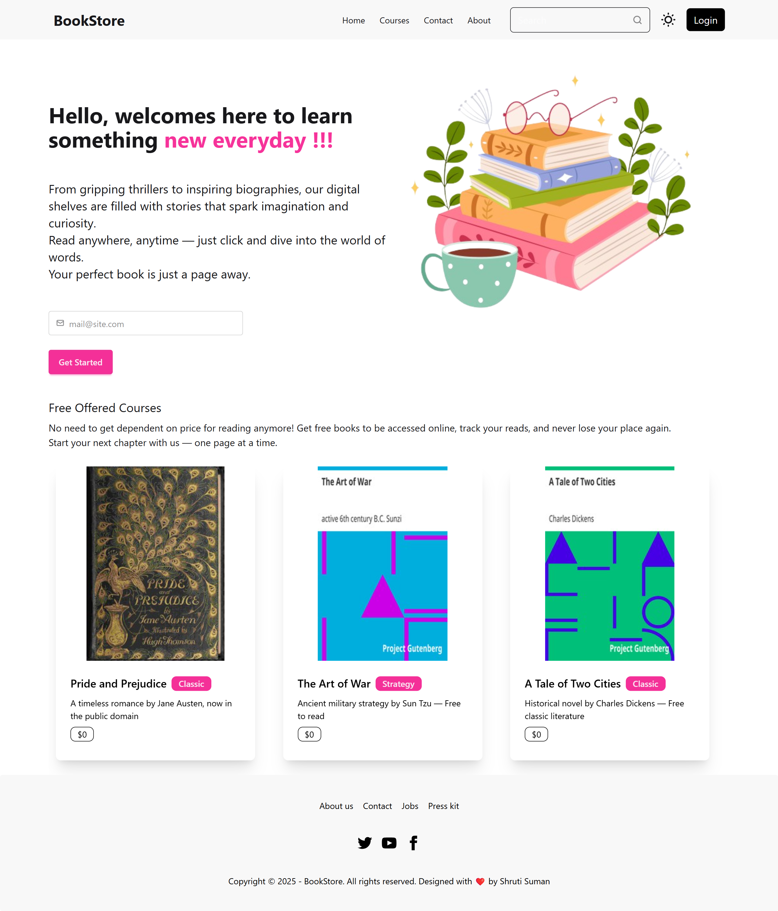
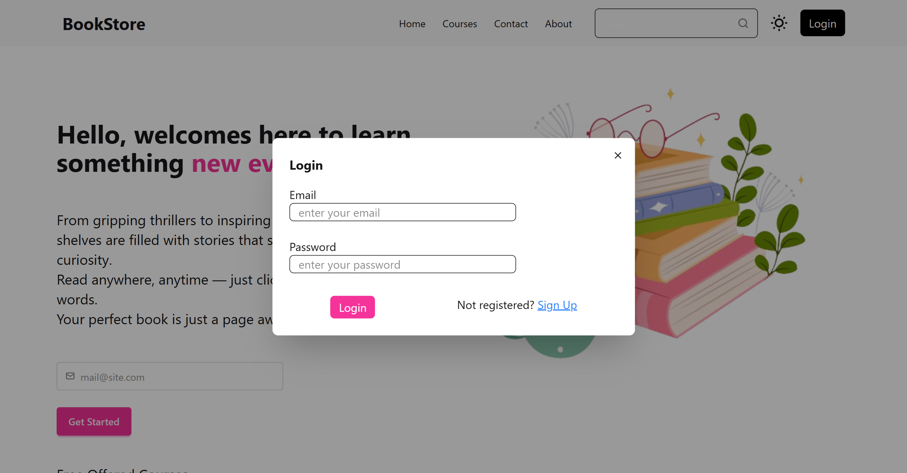
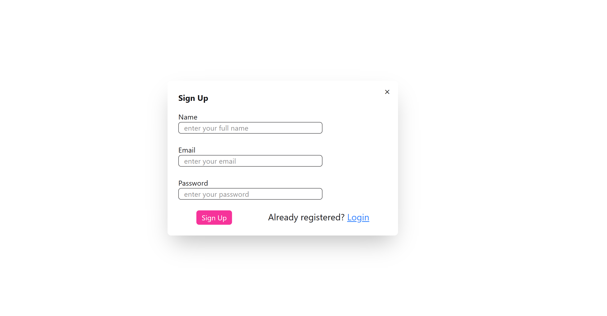
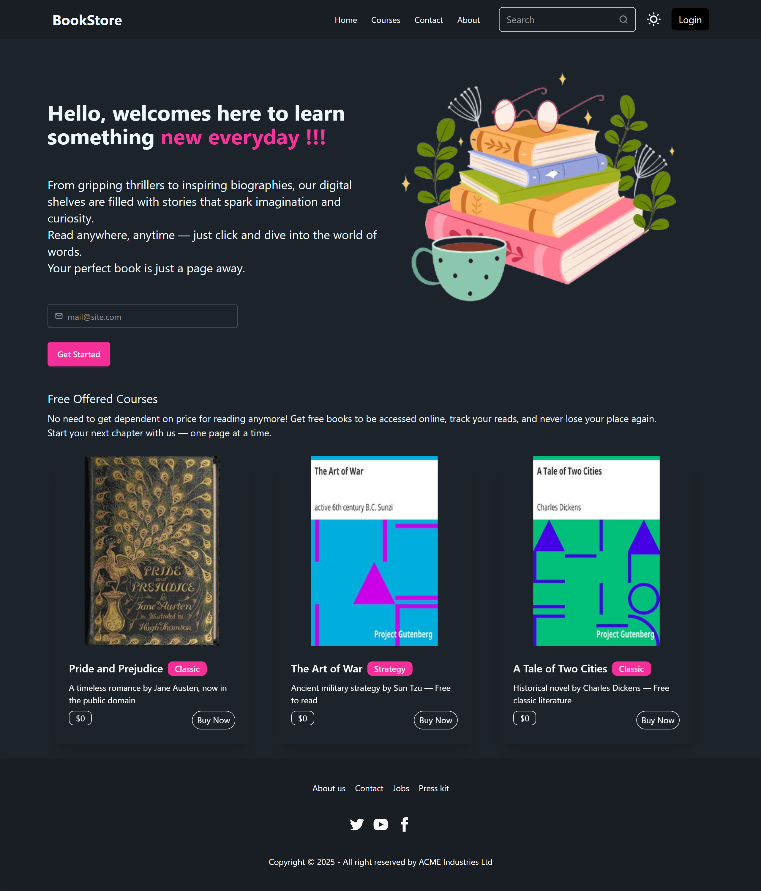

# 📚 Book-Store

A MERN-stack e-commerce book-store app.

A modern online bookstore where users can explore **free books** on the homepage and **access exclusive paid content** in the "Courses" section after logging in. The site features **user authentication**,
including registration, login, and logout, along with a beautiful **light/dark mode toggle**.

---

## 🚀 Features

- 🆓 **Free Books** displayed on the home page
- 🔐 **User Authentication**
  - Register new users
  - Secure login and logout
- 🎓 **Courses Section** with paid books — accessible only after login
- 🌗 **Light and Dark Mode** support

---
##  🛠️ Technology:
- Mongoose
- Express.js
- React.js
- Node.js
  
## 🖥️ Screenshots
- Home Page  
  
- Login Page  
  
- Signup Page  
  
- Course Page  
  
- Dark Mode  
  

  ## Demo Link

[Click me to see the app!](https://bookstore-zone19-05.netlify.app/)
  
